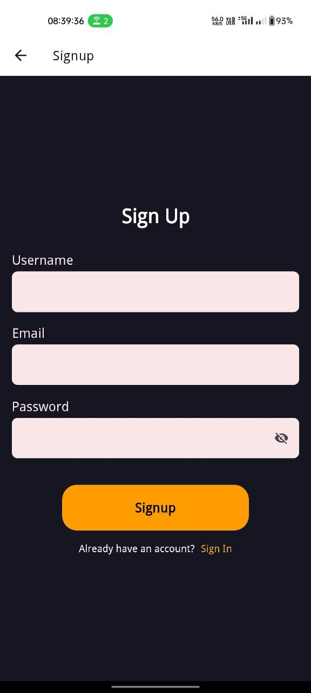

# Scarab

Scarab is a social media application that allows users to create, schedule, and manage posts.

## Table of Contents
- [Features](#features)
- [Screens](#screens)
- [Screenshots](#screenshots)
- [Installation](#installation)
- [Usage](#usage)
- [Contributing](#contributing)
- [Contributors](#contributors)

## Features
- **Create Posts:** Users can create new posts with images and captions.
- **Schedule Posts:** Users can optionally schedule posts to be published at a future date and time.
- **Feed:** View all posts in a real-time updated feed.
- **Favorites:** Add and view favorite posts.
- **Profile:** Manage and view user profiles and their posts.
- **Bottom Tab Navigator:** Seamless navigation across the app using a bottom tab navigator.
- **Drawer Navigation:** Access additional features and settings through a drawer navigator.

## Screens
- **Getting Started:** Welcome page with an overview of the app.
- **Sign Up:** Register a new account.
- **Sign In:** Login to an existing account.
- **Feed:** Browse and interact with posts.
- **Create:** Create and schedule new posts.
- **Profile:** View and edit user profiles.
- **Favorites:** View favorite posts.

## Screenshots
### Getting Started


### Sign Up


### Sign In


### Feed


### Create


### Favorites


### Profile


## Installation
1. Clone the repository:
    ```bash
    git clone https://github.com/Akanksha0900/Scarab
    cd Scarab
    ```

2. Install dependencies:
    ```bash
    npm install
    ```

3. Start the development server:
    ```bash
    npm start
    ```

4. For iOS:
    ```bash
    npm run ios
    ```

5. For Android:
    ```bash
    npm run android
    ```

## Usage
1. **Creating a Post:** Navigate to the Create page using the bottom tab navigator, fill in the post details, and optionally schedule it.
2. **Viewing Feed:** Browse posts in the Feed page. Scheduled posts will appear once their scheduled time arrives.
3. **Adding to Favorites:** Tap the favorite icon on a post to add it to your favorites.
4. **Profile Management:** View and edit your profile from the Profile page.

## Contributing
We welcome contributions! Please fork the repository and create a pull request with your changes.

1. Fork the repository
2. Create a new branch (`git checkout -b feature-branch`)
3. Commit your changes (`git commit -m 'Add new feature'`)
4. Push to the branch (`git push origin feature-branch`)
5. Create a new pull request

## Contributors
- **[Akanksha Pandey](https://github.com/Akanksha0900/)**
- **[Rakesh Kumar Gorai](https://github.com/RakeshKrGorai)**
- **[Subham Nayak](https://github.com/subham206)**
